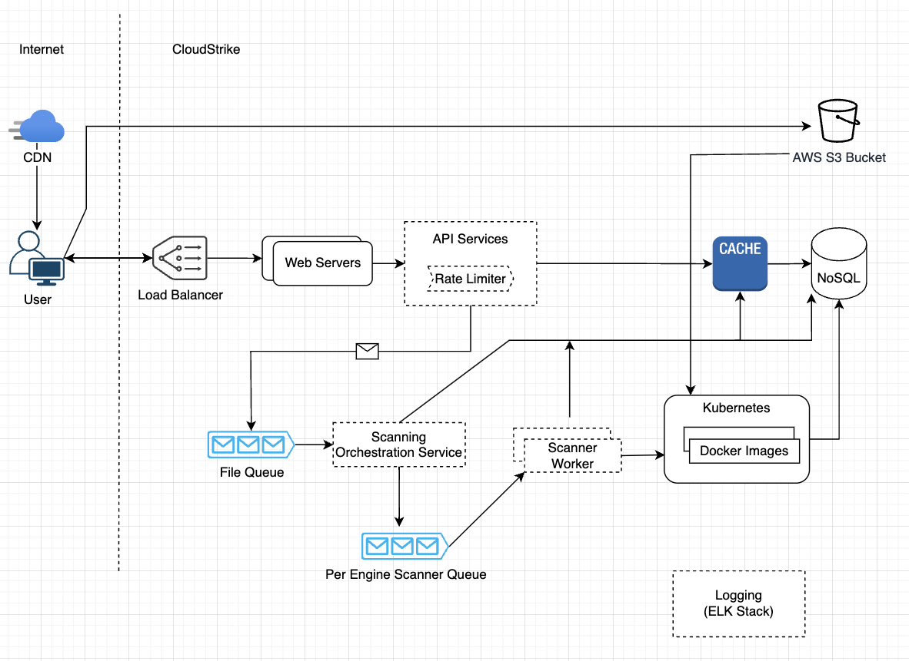
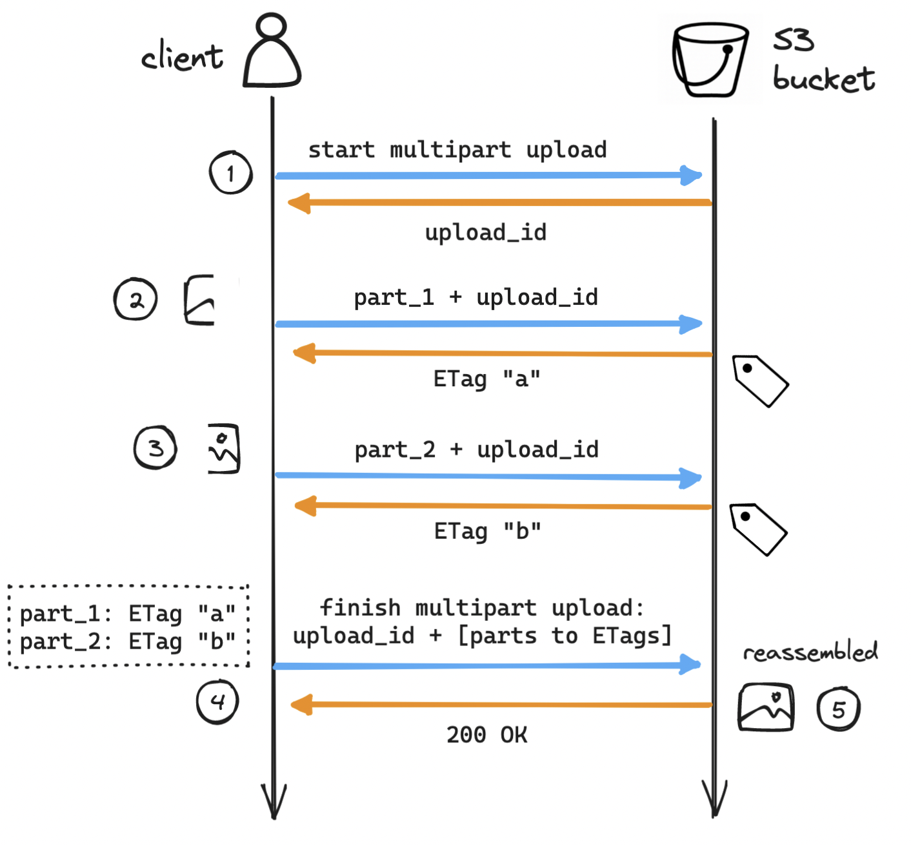

# VirusTotal Design Project

- [The System Design Problem](#The-Problem)
- [Overall Design:](#overall-design)
- [Component Summary:](#component-summary)
- [Client Website:](#client-website)
- [Web Service:](#web-service)
- [File Storage:](#file-storage)
- [Database:](#database)
- [Caching:](#caching)
- [Error Handling:](#error-handling)
- [Observability:](#observability)
- [WS Schema:](#ws-schema)
    - [Submit a file](#submit-a-file)
    - [HTTP POST](#http-post)
- [Scaling:](#scaling)

* * *

&nbsp;

## The System Design Problem:

This “whiteboard” project will be building a “VirusTotal” clone. This is a hypothetical design project that requires you to consider real world distributed systems challenges based on a publicly available product. You can read up more about VirusTotal by visiting their website at https://www.virustotal.com and going to **About Us > How it works**. You are also encouraged to try the system out by uploading a file so that you can get a feel for the end-user experience.

**Functionality**

Your task is not to replicate all of VirusTotal, but to understand the core functionality of VirusTotal and propose an architecture that will accomplish the following goals:

- Allow users to upload files to be scanned by multiple AV engines and metadata extraction scripts.
    
- Engines and scripts may perform a wide range of operations such as: run a proprietary virus scanner, extract metadata from file headers, make calls to external service endpoints, execute uploaded files to observe their behavior, etc.
    
- Store metadata and AV engine results about uploaded files.
    
- Retrieve metadata about uploaded files (including file attributes, metadata and AV engine results).
    
- Here is an example of metadata collected from file uploads: https://www.virustotal.com/en/file/0bf01094f5c699046d8228a8f5d5754ea454e5e58b4e6151fef37f32c83f6497/analysis/
    
- Ensure all major functionality is available via both a user interface and a public-facing APIs that users can build apps on top of.
    

**Requirements and Constraints**

When designing a system to support the aforementioned functionality, please also consider the following requirements and constraints:

- The system must support millions of users per day.
- Uploaded files can range in size from 100K to 1GB.
- Uploaded files should be retained as long as possible (ideally forever).
- The system must provide results as close to real-time as possible.
- Metadata and scanning services can run on a mixture of Linux or Windows (not all scanning services support the same OS).
- Your design should be able to accommodate the addition of new AV engines or metadata scripts. These additions should be as minimally invasive to the running system as possible (i.e. minimal or zero system downtime, no “big bang” deployments, etc.).

**What are we looking for?**

We’d like you to be as detailed as possible without needing to write any actual code. You should be prepared to talk about:

- The services that need to be built and their APIs
    
- The flow of data through the system and how we’ll process files efficiently
    
- Data organization including structure, schemas, sharding and partitioning
    
- Metrics and operational information (to ensure the system is running properly)
    
- Availability, scalability and fault tolerance
    
- Choice of underlying technologies
    
- For the purposes of this assignment, we recommended choosing technologies that you're familiar with and are comfortable discussing
    

**Some sample questions you can expect might include:**

- How does the design address the basic requirements?
- How and where will we store the data?
- What is the structure and schema (if applicable) of our stored data?
- What technologies will we use?
- How will we handle failures in the system?
- What might a sample API request/response look like?
- How might we extend this architecture to add new features?
- Etc.

We will be validating that you have sound ideas, that you can collaborate with us, and that you can you translate what’s in your head into pictures that communicate your intentions effectively.

If interviewing in person, be prepared to collaborate with your interviewers on a whiteboard. If interviewing remotely, please prepare materials, such as a high-level block diagrams, to share with your interviewers in order to facilitate the discussion.

Interviews are meant to be bidirectional, so please also consider your own experience and whether or not you enjoy collaborating with us during the interview as well. This exercise is meant to be indicative of how we design new features and systems inside CrowdStrike.

If you have any questions at all, please feel free to ask!

&nbsp;

&nbsp;

# My solution:
- Written by Paul Senatillaka

&nbsp;

## Overall Design:



&nbsp;

## Component Summary:

- Load Balancer
    - Distribute incoming load of HTTP requests to api services on web servers
- API Services (within Web Server)
    - Routes and manages incoming API requests using Spring Cloud Gateway
    - Drops a message on queue for each file to scan
    - Could be prioritized queue msg for payed customers
- Queuing
    - Provides Async queue and processing of file scan requests
- Scanner Orchestration Service
    - Organizes the many worker services that will be scanning for each virus engine
    - Creates a new queue msg for each scan that will occur with instructions
    - Updates final status when all scans are done
- Scanner Worker
    - Service that starts containers like docker/VMware/etc. inside Kubernetes cluster
    - Fetches and runs scanner script
    - Pushes result of scan DB
- NoSQL Database
    - Stores results of scans, file metadata, list of scans to perform, and instructions.
    - Sharding done on file hash
- File Storage
    - AWS S3 Buckets since it's cheap and easily scalable
    - Users can push directly to S3 bucket to prevent load on internal servers. This is provisioned by initial WS call.
- Cache
    - Holds results of scan for file. Same structure as DB. Allows for fast access of recent scans w/o hitting DB.
    - Scanner writes to this cache as a write through when it's updating scan results in the DB.
    - Least Frequently Used eviction policy to trim size to avail memory

&nbsp;

## Client Website:

Func Specs:

- Upload files
- View status of submissions
- View results of scans. Metadata, file attributes, AV results, etc.

Tech:

- SPA. React or Angular
- Uses exposed WS

&nbsp;

## Web Service:

- File Upload Start WS
    
    - Signals that client wants to start a large file upload. Provisions a AWS S3 Bucket, and returns that in the WS for client to upload to.
    - Client side can MD5 hash file first and send to check if file results exist already. Short circuits the whole upload process.
- File Upload WS (Amazon S3 Bucket)
    
    - Since files can be large (100KB - 1GB). This WS is directly with AWS S3 to upload. Refer to documentation there.
    - Multi-part HTTPS file upload if we need more performance. S3 has support for this
        - Resumable
        - Saturates network more for parallel processing
        - Lots of client side OOB libraries to support
    - Can add a framework like MinIO if want to swap out file hosting solution (ie self hosted). Exposes same S3 APIs so seemless integration.
    - ### AWS MultiPart S3 Uploading Sequence Diagram:
        
        
- File Report WS
    
    - Retrieves processed scan report
    - Overall file scanning status in response so client can poll endpoint
    - As individual scans are complete, results will stream in and show up in poll requests.
- Authentication if wanted
    
    - OATH2 / JWT Tokens

&nbsp;

## WS Schema:

### 1) Submit a file

`/api/v1/scanner/file`

**HTTP POST Request:**

```
// Header
"Api-Key": "4KE35KEM"

// HTTP Request Body
{
  fileSize: 5321000,
  md5: "LKJEE1244K33KMEW1",
}
```

**HTTP 200 Response:**
```
// HTTP 200 Request Response
{
    // AWS S3 Upload URL
    fileUploadURL: "https://s3.amazon.com/s3/userFiles/2F8JU5Y34E23"
}
```

**HTTP Error Response:**
429 - Too many request (rate limited)
500 - Server side unexpected errors


### 2) Upload a file directly to AWS S3 through provisioned url
https://docs.aws.amazon.com/AmazonS3/latest/userguide/PresignedUrlUploadObject.html

### 3) Get a file scan report summary

**HTTP GET Request:**
`/api/v1/scanner/file/{id}`

**HTTP Response:**

```
// HTTP Response
{
  status: "PROCESSING",  // Poll on this status
  statusCode: 100,
  metaData: {
      fileName: "test.exe",
      fileSize: 5321000,
      hash: "a851aaa741c8c9efdf97eb56bd5afdfb",
  },
  scans:    // Scan results stream in as async scanning is processing
  [
      {
      "engine_name": "EngineX",
      "scan_time": "2024-04-21T10:00:00Z",
        "status": "Running",
      "result": "infected",
      "metadata": {
        "threat_level": "high",
        "detected_malware": "Trojan XYZ",
        "additional_info": "..."
      }
  ], ...
}
}
```

**HTTP Error Response:**
HTTP 400 - File not found

### 4) Rescan a file already submitted  

**HTTP POST Request**
`/api/v1/scanner/file/{hash_id}/rescan`
This should be privaleged or heavily rate limited to avoid excessive load on the system.


## File Storage AWS S3:

- Use AWS S3 buckets. Cheap distributed storage, offers recovery, and scaling
- Bucket Name: `userFiles`Bucket Prefix : `/{sessionId/`  -  User uploaded files go here first. We don't trust client's hashId so store under session temporarily
- Bucket Name: `files` Bucket Prefix : `/{hashId}/`  - Stores files permanently that are processed by the worker scanners.  Hash computed server side.
- Starting prefix with random md5 hash id ensures even distribution across bucket and avoids hotspots
- Optional: Cold (longer term. Cheaper, slower, storage) and Hot Storage (active)

&nbsp;

## Database:

- Could be RDBMS but don't have lots of complicated joins
- NoSQL better for semi structured sparse file metadata.
    - High availability, easy scaling, fast read / writes on a single entity (file hash)
    - Don't need to complex joins. Record ID is file hash
    - No fixed schema. Easy to update data model later. Sparse data compression.

**Sample Document Object Storage Schema:**

```NOSQL
{
  "file_id": "a851aaa741c8c9efdf97eb56bd5afdfb",
  
  scans: [{
  "engine_name": "EngineX",
  "scan_time": "2024-04-21T10:00:00Z",
  "result": "infected",
  "metadata": {
    "threat_level": "high",
    "detected_malware": "Trojan XYZ",
    "additional_info": "..."
  }}, ...
  ]
}
```

**Sharding Key: file_hash**

## Caching:

- Caching to store commonly read / recent database file report metadata
- DB writes of file scans are written through to cache too. Idea is that results will be viewed soon after, lets cache for fast access and no DB I/O.
- In memory cache like MemCache or Redis
- Could cache cluster if need to scale
- Key: file hash
- LFU for eviction policy

&nbsp;

## Error Handling:

- Worker retry logic - Resubmit to queue limited number of times. Metadata in queue object keeps track of count.
- Orchestrator service can handle unexpected terminating / dead / timed out worker services. If no worker doesn't process after some timeout, mark failed.
- Logging + escalation (alerting) after failed retries

&nbsp;

## Observability:

- Real time metrics
    - Metrics: API Requests, File Size, File Type, File cache hits, Worker scan time, Scan type, Scan env
    - API Req Dimensions: Locale, Client type, User Agent
- Logging: ELK Stack is great for log ingestion and metrics.
    - Elastic Search. LogStash. Kibana
    - Good Kubernetes OOB integration

Sample ELK Observability dashboard for Kubernetes  


## Scaling:

- Add Web servers
- Add Workers
- Queue cluster
- Add DB servers. DB Shard / Partioning
    - Shard DB on file hash. Lookup table
- CDN for static resources
- Rate limiting. Same user or ip can process 1 file at a time
    - General rate limit that can scale with system resources (worker nodes)
    - Cache of queued user id / ip. Worker removes. Longer TTL
- Bot detection

